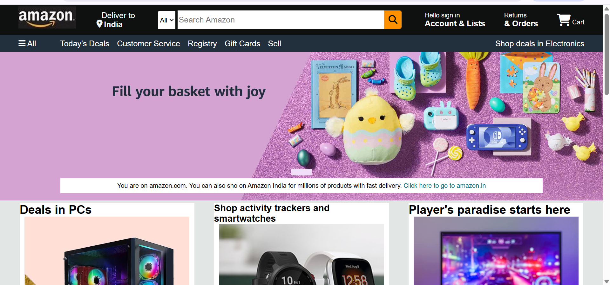
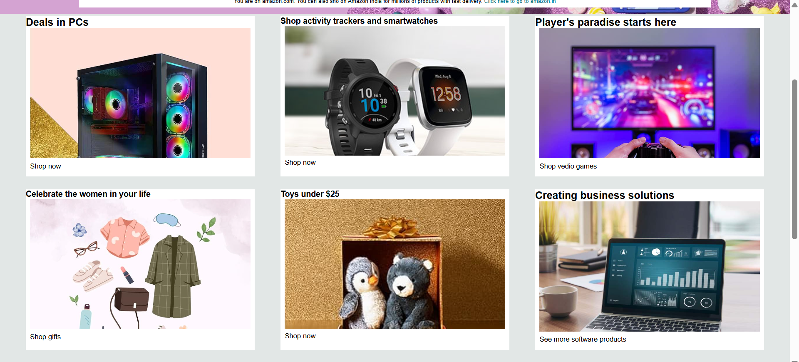
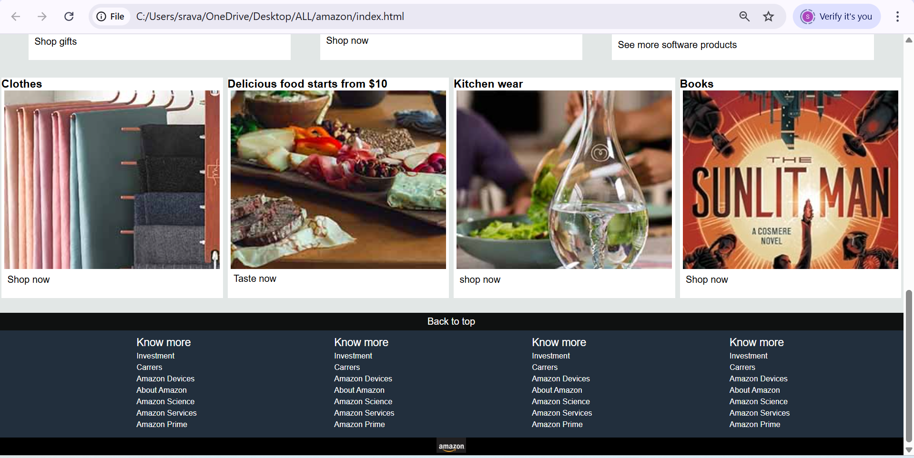

# 🛒 Amazon Homepage Clone

This project is a simple HTML and CSS recreation of Amazon's homepage layout, developed as part of my full stack learning journey.
It features a custom hero section and product display cards to simulate e-commerce storefront styling.

## 💡 Key Concepts Practiced

- Semantic HTML layout structure
- Responsive design using CSS Flexbox/Grid
- Asset organization and image optimization

## 🔍 Preview

### Hero Section  

### Product Section 1  

### Product Section 2  

